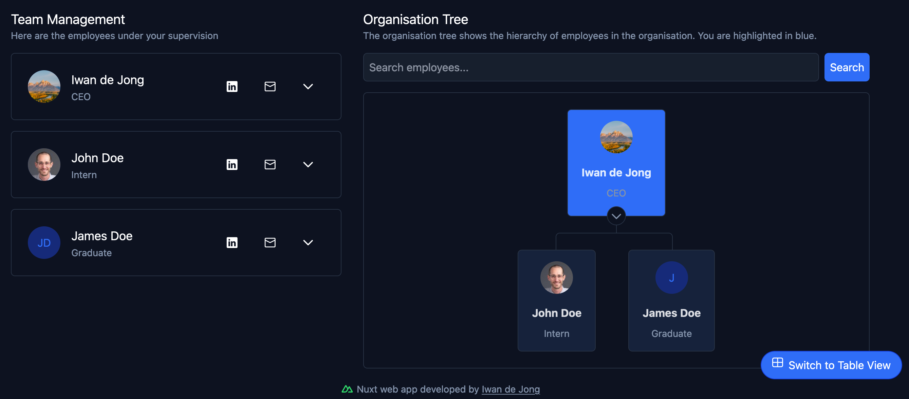

# EPI-Hub README

## Introduction

This web application is designed to manage an organization's employee hierarchy. It allows authorized users to create, read, update, and delete (CRUD) staff information. The app features a visual representation of the organization's hierarchy for easy understanding. 

## Project Badges


<a href="https://wakatime.com/badge/user/47623a7b-3423-456c-8fc6-cbf861f9eb2d/project/a37f668f-9c18-4718-98a1-4f3a6e3dda89"></a>

## Technologies


## User Stories

### User Story 1: Manager

As a manager I want to be able to perform CRUD operations on the staff from our company for who I’m responsible. I want full control over the staff and be able to see the hierarchy tree to keep my company organized and well-structured.

### User Story 2: Employee

As an employee I want to be able to perform CRUD operations on the staff from our company for who I’m responsible. I also want to see the hierarchy tree to be able to see where I fit in the organization. I want to be able to see my own details and update them if necessary.

## Architecture

For this application, a layered architecture would be most simple, to keep the system secure and simple. The reason for simplicity is because of the nature of the project, as it is focused on basic operations. Scalability will also be kept in mind as an organization can scale over time. Also, considering modularity, a layered architecture would be most suitable for the situation given that new functionality can bring the application to new levels. All of this promotes the use of a layered architecture for this specific web application without overcomplicating the system with a complex architecture which might affect performance and scalability in the long run.

### Constraints

Due to the nature of the project, time constraints were a major factor in the design and implementation of the application. The application was developed in a short period of time, which limited the scope of the project and the features that could be implemented. As a result, the application focuses on basic CRUD operations and does not include more advanced features such as notifications and other advanced functionality.

Here are some things I would have done differently if I had more time:

Can include staff satisfaction, average response time, clock-in and clock-out times, contract specific details (in a profile page: booking leave, employee's resume, reviews, reference letters, performance metrics, and ability to store the employee's CV), salary history (maybe through graphs). Other staff related measures can be added if there’s time. An in-app help menu might also be helpful if one gets stuck.

## User Manual

### Installation

To install the application, follow these steps:
1. Clone the repository.
2. Run `npm install` to install the dependencies.
3. Run `npm run dev` to start the development server.

### Deployment

The application is deployed on Vercel. You can access the live version of the application [here](https://epi-org.vercel.app/).

### Creating an account & logging in

To use the application, follow these steps:
1. Register an organization, by clicking on the "Create Organization" button.


2. You can then fill out your own details (as the organization owner) and click on the "Create Organization" button.


After that you'll be redirected to the login page where you can login with the details you just created.

### Joining an organization

To join an organization, follow these steps:
1. As organization owner, you can create an employee by clicking on the "+" button on the top right corner of the dashboard.


2. Fill out the employee details and click on the "Submit & Copy to Clipboard" button. The code will be copied to the clipboard, and you can share it with the employee.


3. The employee can then paste the code in the "Join Organization" field on the login page and click on the "Join Organization" button and fill out their details.


### Dashboard


At the top of the dashboard, you will see the organization statistics. These are read-only and displays useful statistics regarding the organisation and its employees.


When you are not managing any employees, the dashboard will display a message:


Otherwise, you will see a list of employees that you are managing. You can click on an employee to view their details, or click on the "+" button to add a new employee.



To update an employee's details, click on the "Manage Employee" button after selecting the employee.


This will open a modal where you can update the employee's details. Here you can update & delete the employee.


To delete an organisation, you need to be the owner of the organization. Click on your account in the top right corner and select "Manage Account & Organization". Then click on the "Delete Organization" button. Here you can delete the organization and all its employees as well as update your own account details.


### Searching for an employee
You can search for an employee in the hierarchy by typing their name in the search bar just above the organisation tree. This will highlight the employee in the tree.


Alternatively, you can click on the "Search" button to search for an employee by any of their details. This will redirect you to the table view:


In the Table view, you can sort the employees by any of their details by clicking on the column headers.


### Table view

In the table view, you can see all the employees in the organization. You can sort the employees by any of their details by clicking on the column headers. You can access an employee's details by clicking on the "Switch to Table View" button.


### Logging out

To log out, click on your account in the top right corner and select "Sign out".


## Design Patterns

### State

Application makes use of AuthJS to manage the state of the user. This allows the application to keep track of the user's authentication status and role. This is not a direct design pattern but a concept that is used in the application.

### Façade

Nuxt provides a façade for the Vue framework, making it easier to build server-side rendered applications. This allows the application to be more performant and easier to maintain.

### Middleware

The application uses middleware to handle authentication and authorization. This allows the application to restrict access to certain routes based on the user's role.

## Security

### Authentication

The application uses JWT (JSON Web Tokens) for authentication. When a user logs in, a JWT token is generated and stored in the browser's local storage. This token is then sent with every request to the server to authenticate the user.

### Authorization

The application uses role-based access control to restrict access to certain resources. Each user has a role (e.g., manager, employee) that determines what actions they can perform. For example, a manager can create, read, update, and delete employees, while an employee can only read their own details.

### Password Hashing

The application uses `crypto` to hash passwords before storing them in the database. This ensures that passwords are securely stored and cannot be easily decrypted.

## Organisation Hierarchy

The application uses a tree data structure to represent the organization hierarchy. Each node in the tree represents an employee, and the edges represent the relationship between employees (i.e. the employee's manager). This allows the application to visualize the organization hierarchy and display it to the user.

### Algorithm

The tree is built by using a recursive algorithm that traverses the organization hierarchy and constructs the tree. The algorithm starts at the root node (the organization owner) where the manager is `null`. It then recursively adds employees to the tree by finding all employees whose manager is the current employee.

Here is the pseudocode for the algorithm:

```
function buildTree(employees, managerId):
    // Create an empty list to store employees under the current manager
    tree = []

    // Loop through each employee
    for each employee in employees:
        // Check if the employee reports to the given managerId
        if employee.manager == managerId:
            // Recursively build the tree for this employee's children
            employee.children = buildTree(employees, employee.employeeId)
            
            // Add the employee (and their children) to the tree
            tree.add(employee)

    // Return the tree for this manager (including all nested children)
    return tree
```

## Database Schema

The database schema for this application is simple and straightforward. It consists of two tables: `employee` and `organisation`.


The `employee` table contains the following columns:
- `id`: The unique identifier for the employee.
- `firstname`: The first name of the employee.
- `lastname`: The last name of the employee.
- `birthdate`: The date of birth of the employee.
- `employeeid`: The unique employee ID.
- `salary`: The salary of the employee.
- `role`: The role of the employee.
- `manager`: The manager of the employee, a foreign key that references the `employee` table.
- `joiningdate`: The date the employee joined the organization.
- `leavedays`: The number of leave days the employee has.
- `linkedin`: The LinkedIn profile of the employee.
- `orgid`: The unique organization ID, a foreign key that references the `organisation` table.
- `email`: The email address of the employee.
- `password`: The (hashed) password of the employee.
- `bio`: The biography of the employee.
- `gravatarurl`: The Gravatar URL of the employee.

The `organisation` table contains the following columns:
- `id`: The unique identifier for the organization.
- `name`: The name of the organization.

## API Endpoints

The API endpoints for this application are as follows:
- `POST /api/auth/register/emp`: Register an employee.
- `POST /api/auth/register/org`: Register an organization.
- `POST /api/create/employee`: Create an employee.
- `POST /api/delete/employee`: Delete an employee.
- `POST /api/delete/org`: Delete an organization (and all employees).
- `POST /api/read/account`: Read an account.
- `POST /api/read/employees`: Read employees.
- `POST /api/read/org`: Read an organization.
- `POST /api/read/tree`: Read the organization hierarchy.
- `POST /api/update/employee`: Update an employee.

## Technologies Used

The application is built using the following technologies:

- *Frontend*: Nuxt.js, Tailwind CSS
    - Nuxt.js provides a simple way to create a Vue.js application with server-side rendering and static site generation. Tailwind CSS is a utility-first CSS framework that allows for rapid prototyping and easy customization.
- *Backend*: Nuxt.js (Node.js)
    - Nuxt.js is used for the backend as well, as it provides a simple way to create APIs using the same codebase as the frontend.
- *Database*: PostgreSQL
    - Vercel provides a managed PostgreSQL database that is used to store the application data securely.
- *Deployment*: Vercel
    - Vercel is used to deploy the application to the web. It provides a out-of-the-box and simple way to deploy Nuxt.js applications with serverless functions.
- *CI/CD*: GitHub Actions
    - GitHub Actions is used to automate the deployment process. It runs the tests and deploys the application to Vercel when changes are pushed to the main branch.
- *Design*: Figma
    - Figma is used to design the wireframes to visualize the application layout and user interface.
- *Package* Manager: NPM
    - NPM is used to manage the application dependencies. It provides a simple way to install and manage the packages used in the application.
- *Avatar*: Gravatar
    - Gravatar is used to generate avatars for the employees. It provides a simple way to create unique avatars based on the user's email address.
